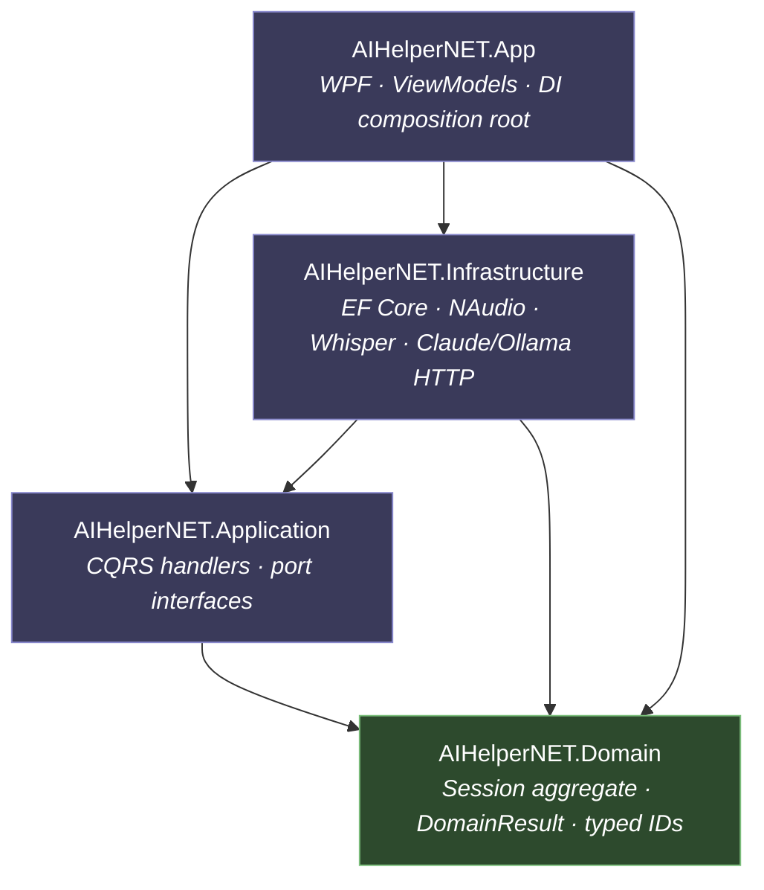
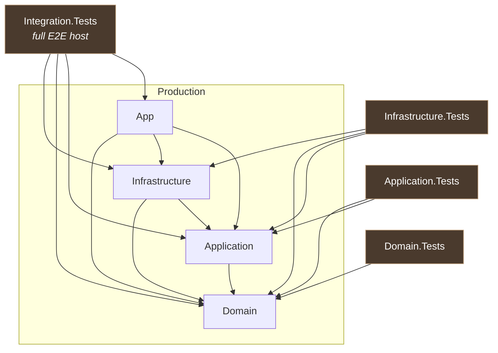

# Project Dependency Architecture

> Generated from `.csproj` `<ProjectReference>` declarations (the source of truth for
> compile-time layering). 100% derived from the build graph — no runtime analysis.

AIHelperNET is a **Clean / Hexagonal + DDD + CQRS** solution. The defining property of
the architecture is the **direction of dependencies**: every layer points *inward*
toward `Domain`, which itself depends on nothing.

## Production layers (`src/`)



### How to read it

- **`Domain` has zero outgoing edges** — the dependency sink. Everything points inward
  toward it. This is the core invariant of Clean/Onion architecture, and the graph shows
  it holds with no leaks.
- **`Infrastructure` → `Application`** (not the reverse). This is **Dependency Inversion**:
  `Application` *defines* the port interfaces (`ITranscriptSink`, `IAudioCaptureService`,
  `ITranscriptionService`, `IAnswerProvider`, `ISessionRepository`, …) and `Infrastructure`
  references `Application` only to *implement* them. The compile-time dependency arrow and
  the runtime call direction point opposite ways — the essence of ports & adapters.
- **`App` is the composition root** — the only project referencing all three, because it
  wires concrete `Infrastructure` adapters to `Application` ports in DI. Nothing references
  `App` except the integration test host.
- **The graph is acyclic** — no layer cycles.

## Test topology (`tests/`)

Each test project references exactly the layers under test; `Integration.Tests` references
`App` to drive the full end-to-end host.



## Reference: raw reference matrix

| Project | References |
| --- | --- |
| `Domain` | — (none) |
| `Application` | Domain |
| `Infrastructure` | Application, Domain |
| `App` | Application, Infrastructure, Domain |
| `Domain.Tests` | Domain |
| `Application.Tests` | Application, Domain |
| `Infrastructure.Tests` | Application, Domain, Infrastructure |
| `Integration.Tests` | App, Application, Domain, Infrastructure |

## Regenerating the images

The `.svg` / `.png` files are generated from the `.mmd` sources with
[`@mermaid-js/mermaid-cli`](https://github.com/mermaid-js/mermaid-cli). The renderer
needs a Chromium; to reuse a system Chrome instead of downloading one, create a local
`docs/architecture/.puppeteer.json` (git-ignored, machine-specific) pointing at it:

```json
{ "executablePath": "C:/Program Files/Google/Chrome/Application/chrome.exe", "args": ["--no-sandbox"] }
```

Then, from `docs/architecture/`:

```bash
npx @mermaid-js/mermaid-cli -i project-dependencies.mmd -o project-dependencies.svg -p .puppeteer.json -b transparent
npx @mermaid-js/mermaid-cli -i project-dependencies.mmd -o project-dependencies.png -p .puppeteer.json -b white -s 3
npx @mermaid-js/mermaid-cli -i test-topology.mmd        -o test-topology.svg        -p .puppeteer.json -b transparent
npx @mermaid-js/mermaid-cli -i test-topology.mmd        -o test-topology.png        -p .puppeteer.json -b white -s 3
```

Source of truth is the `.mmd` files; re-run after editing them.
