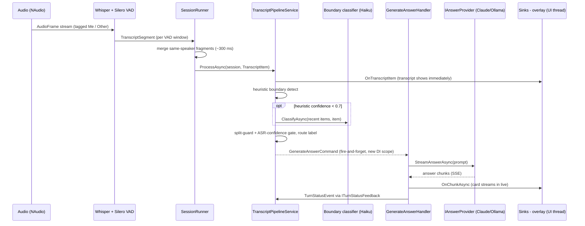

# Request Lifecycle — how a spoken question becomes an answer card

> Companion to the static **Code map** (`CLAUDE.md`) and the layer graph
> (`project-dependencies.md`). This one describes the **dynamic flow**: what data moves through
> which component, in what order, when you speak during a live session. Grounded in the actual
> code (`SessionRunner`, `TranscriptPipelineService`, `GenerateAnswerHandler`) — file/line drift
> is possible, so verify against source before relying on a specific call.

There are two entry points that end in an answer card on the overlay: **live audio** (the spine)
and **screen capture**. Both converge on the same `GenerateAnswerCommand`.

## 1. Live-audio path (the spine)

**Step by step:**

1. **Capture** — `NAudioCaptureService.CaptureAsync` yields `AudioFrame`s already tagged by source:
   microphone → `Speaker.Me`, loopback → `Speaker.Other`. `SessionRunner` fans them into two
   per-speaker channels (`AudioSourceMode` can disable either side).
2. **Transcription** — two independent `WhisperTranscriptionService` instances (one per speaker)
   consume their channel. Silero VAD windows the audio on silence gaps (~600 ms); each window is
   transcribed to a `TranscriptSegment` (text + ASR confidence).
3. **Merge & serialize** — segments fan back into one `mergeChannel`. The consumer greedily merges
   consecutive **same-speaker** fragments within `segmentMergeWindowMs` (~300 ms) into one
   `TranscriptItem`, then calls `pipeline.ProcessAsync` **sequentially** — `Session` is not
   thread-safe, so this single-consumer discipline is load-bearing.
4. **Pipeline routing** (`TranscriptPipelineService.ProcessAsync` → `BuildCommandWithBoundaryAsync`):
   - The item is added to the session and pushed to the overlay transcript via `ITranscriptSink`
     **immediately** (before any AI).
   - `Speaker.Me` utterances are routed **deterministically** and never generate — they only attach
     as clarification/context to the active turn (`HandleMeUtterance`).
   - For `Speaker.Other`, a heuristic (`QuestionBoundaryDetector`) labels the boundary. **Only if its
     confidence < 0.7** does the AI boundary classifier (Haiku) get called; a bias-free heuristic
     re-check is the safety net if the AI is also unsure.
   - Two guards run before routing: the **split guard** (`BoundarySplitGuard`) demotes a risky
     AI `NewQuestion` to a continuation of the live turn; the **ASR-confidence gate**
     (`AsrConfidenceGate`) drops a garbled low-confidence item that would otherwise fold into and
     corrupt the live turn.
   - `RouteLabel` maps the final boundary label to a turn action — start collecting, append a
     fragment, complete the question, refine after clarification, or open a new turn — and returns a
     `GenerateAnswerCommand` only when an answer should fire.
5. **Fire-and-forget generation** — the command is dispatched via `Task.Run` in a **fresh DI scope**
   with a **per-turn `CancellationTokenSource`**. Re-firing the same turn (a refinement) cancels that
   turn's prior in-flight generation; different turns are independent.
6. **Answer** (`GenerateAnswerHandler`):
   - Resolves the provider by `settings.ActiveBackend` (Claude or Ollama).
   - Assembles context: the question text (all collected fragments), recent transcript, attached
     clarifications, and the last few completed Q&A turns.
   - Builds the prompt with `PromptBuilderService.Build(..., maxTokens: settings.MaxAnswerTokens)` —
     this is where untrusted text (question, transcript, OCR) is **fenced and labeled as data**.
   - Streams `provider.StreamAnswerAsync` chunk-by-chunk into `IAnswerStreamSink.OnChunkAsync`, so the
     card fills in live; on completion adds an `AnswerVersion` and calls `OnCompleteAsync`. Errors go
     out as a friendly message via `OnErrorAsync` (never raw provider JSON).
   - Persists with **EF change-tracking only** (no full-graph `Update`) so it can't clobber
     pipeline-owned columns.

## 2. Screen-capture path

The `CaptureScreen` hotkey triggers `CaptureScreenCommand`, which is **OCR only**
(`IScreenOcrService.CaptureAndReadAsync` → foreground-window grab + Windows OCR → text). The App
layer then aggregates rapid successive captures (`ScreenCaptureAccumulator`, gap-grouped) and turns
the result into a screen turn whose `GenerateAnswerCommand` carries the OCR as `ScreenContext`. While
that captured task stays "in focus" (`ScreenTaskContextStore.Current`), interviewer speech that adds
to or asks about it is recognized by `IScreenFollowUpClassifier` and spawns a **new** context-aware
card via `GenerateScreenFollowUpCommand` — the original capture card is never mutated; "moved on"
speech clears the linkage.

## 3. Three decoupling seams worth knowing

- **Sinks (App-layer singletons).** `ITranscriptSink`, `IConversationTurnSink`, `IAnswerStreamSink`
  are the Application↔UI boundary. Their App implementations (`TranscriptSink`, `AnswerStreamSink`)
  marshal to the WPF dispatcher. The Application layer never touches a `Window`.
- **`ITurnStatusFeedback` (the status bridge).** Because generation runs in a **separate DI scope**
  from the pipeline, the handler's `turn.TransitionTo(...)` changes are invisible to the pipeline's
  authoritative in-memory `Session`. The handler **publishes** `TurnStatusEvent`s; the pipeline
  **drains** them (`DrainStatusFeedback`) into its own session on the next `ProcessAsync`. This is the
  fix for the historical "only one card" / stale-session bug — don't reintroduce a shared session.
- **Per-turn cancellation + `pipeline.Reset()`.** Each turn's CTS isolates regeneration; `Reset()` (in
  `SessionRunner.StartAsync`) wipes all per-session mutable state so the singleton pipeline starts
  every session clean.

## See also

- `CLAUDE.md` → **Code map** (which file owns each step above).
- `project-dependencies.md` → the compile-time layer graph these calls respect.
- Conversation routing rules: `reference-conversation-routing-model` (in auto-memory).
